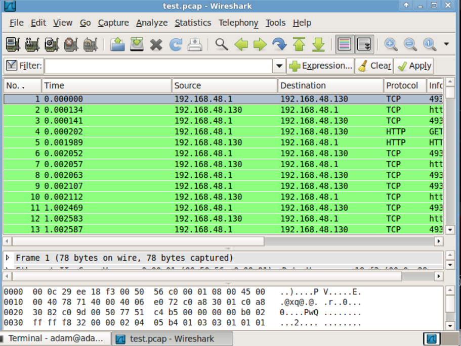

# Traffic
The traffic gem generates a steady stream of HTTP requests over a network in order to demonstrate the ability to identify and distinguish malicious requests from normal network activity.  

# Installation

* Clone the [traffic repository](https://github.com/dalton/traffic)
* cd into the traffic directory

Then in the console 

    sudo gem install traffic # Note: you must have Ruby (1.8 or 1.9) installed; Ruby is included with the back|track linux distro
    
_There is another ruby gem called traffic.  If you `gem install traffic` from a different directory, the other gem will be installed.  Use `gem uninstall traffic` to uninstall the 

This will give you the 'traffic' executable

The traffic executable requires a url and optional request per minutes argument

    traffic [url] [requests per minute]

Note that the url requires the http[s] prefix.

When traffic runs, it will simply print the body of the response to the screen. Traffic will fail if the http request itself is invalid, for example if the connection
if refused.  However, if the http request is valid, traffic does not look at the 
response codes to determine if it was successful or not.  It just prints the response
body to the screen.

At this point, traffic does not produce a log or collect statistics.  However, there are many tools that can be used to analyze the network traffic.  One example is Wireshark, which is discussed later.

Ctrl-c ends the traffic generation.  

# Monitoring Traffic

Traffic can be monitored with any packet sniffing application (ie. snort or tcpdump). 
The packet capture (pcap) can then be viewed, in this case using wireshark.

In the Security Onion VM

First, create a  pcap

    sudo tcpdump -w /tmp/test.pcap

Then, view it in Wireshark

    wireshark /tmp/test.pcap

## Wireshark

Although the generated traffic is very simple HTTP requests, it still provides a good amount of information.  The captured network traffic can be viewed in Wireshark which presents it in a form that is easier for humans to read.  

In this screenshot, you can see all the network activity generated by a simple request from a client (source) to a host (destination) running a vulnerable web application.

### Packet List 
The top part of the Wireshark window is the packet list, where each item represents a single packet captured on network.

### Packet Detail
The middle part is the packet detail - wireshark shows as much as it can about the selected packet.

Details provided include: 

* ethernet
* ip
* tcp 
* other information
* http headers

### Bytes
The bottom part shows the bytes in the current packet.

### Coloring Rules 
Different packets are shown in different colors

DNS - Blue

HGP - Green

### Overview 

Select different header fields and different parts of the packet bytes are highlighted.

Bad TCP will be identified by coloring rules (for example: out of order).

Wireshark allows for filtering of packets.

For a quick introduction to Wireshark [the introduction to Wireshark video](http://wiresharkdownloads.riverbed.com/video/wireshark/introduction-to-wireshark/)

# Related Technology

To install Ruby on Debian/Ubuntu

    sudo apt-get install ruby

    sudo apt-get install rubygems

If you would like to install the gem from the github repository

    sudo apt-get install git

    git clone https://github.com/dalton/traffic.git
    
